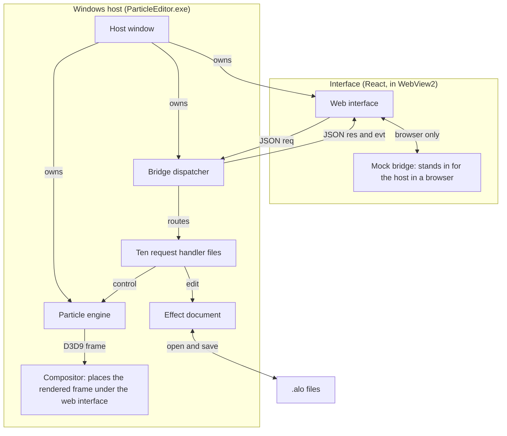

# Find the native code

The **host** is the Windows program that holds the web interface. The
**engine** runs and draws particles. A **bridge request** is a named action
sent from the interface to the host. Start with the thing you want to change.

## How the pieces fit

The [host window](host/HostWindow.h) owns the main window, hidden graphics
device window, WebView2 view, engine and bridge dispatcher; WebView2 loads the
React interface from [embedded resources](host/HostWindow_WebView2.cpp).
The [bridge dispatcher](host/BridgeDispatcher.h) exchanges JSON requests
(`req`), responses (`res`) and events (`evt`) with the interface and routes
requests to the ten [handler files](#find-a-request-handler), which read or
change the effect document and engine.
[File helpers](effect/ParticleSystemIO.h) open and save the effect document as
`.alo` files, while the [compositor](host/Compositor.h) places the engine's
rendered frame behind the web interface.
In a browser, the [mock bridge](../web/apps/editor/src/bridge/mock.ts)
supplies sample state and answers in place of the Windows host.

## Where to make a change

| Change | Open this file and search for |
|---|---|
| A label | [BasicTab.tsx](../web/apps/editor/src/screens/property-tabs/BasicTab.tsx) for `Skip time:`. Other property labels live beside it in AppearanceTab and PhysicsTab. |
| Colours or spacing | [tokens.css](../web/apps/editor/src/styles/tokens.css) for shared colours; [components.css](../web/apps/editor/src/styles/components.css) for rules such as `.form-row`. |
| An emitter setting | [EmitterPropertyTabs.tsx](../web/apps/editor/src/screens/EmitterPropertyTabs.tsx), `commit`, then [BridgeDispatch_EmitterProperties.cpp](host/BridgeDispatch_EmitterProperties.cpp), `emitters/set-properties`. An emitter is one source of particles in an effect. For a new setting, follow [Adding a property field](../web/apps/editor/README.md#adding-a-property-field). |
| A curve value | [CurveEditorPanel.tsx](../web/apps/editor/src/screens/curve-editor/CurveEditorPanel.tsx), `emitters/set-track-key`, then [BridgeDispatch_EmitterTracks.cpp](host/BridgeDispatch_EmitterTracks.cpp) with the same search text. A curve changes a value over a particle's life. |
| Preview timing or motion | [EmitterInstance.cpp](simulation/EmitterInstance.cpp), `Update` and `onParticleSystemChanged`; [SpawnerDriver.cpp](simulation/SpawnerDriver.cpp), `Tick`, for the pane that places effect instances. An instance is one running copy of the effect. |
| Preview drawing | [engine_render.cpp](rendering/engine_render.cpp), `Render`, and [EmitterInstance.cpp](simulation/EmitterInstance.cpp), `UpdateParticle`. |
| Open or Save | [BridgeDispatch_File.cpp](host/BridgeDispatch_File.cpp), `file/open` or `file/save`. Follow `SaveParticleSystem` into [ParticleSystemIO.cpp](effect/ParticleSystemIO.cpp). |
| A guide page | Follow [site/README.md](../site/README.md#guide-markdown--committed-html). Edit the Markdown source, then run `node scripts/build-guide.mjs` and `node scripts/build-guide.mjs --check` from the repository root. |

For a first browser edit and the checks for each change, use
[CONTRIBUTING.md](../CONTRIBUTING.md#start-here). The
[web source map](../web/apps/editor/README.md) follows one property edit all
the way to the saved file.

## Files by job

Open a group when the change crosses from the interface into native behaviour.

| Job | Folder | Files to open | When to open them |
|---|---|---|---|
| Effect definition | `effect/` | [ParticleSystem.h](effect/ParticleSystem.h), [ParticleSystem.cpp](effect/ParticleSystem.cpp), [LinkGroup.cpp](effect/LinkGroup.cpp) | Find stored emitter fields, tree changes, or the rules for sharing settings between emitters. Search for `Emitter` or `copySharedParamsFrom`. |
| File formats and saving | `effect/` | [ParticleSystemSerialization.cpp](effect/ParticleSystemSerialization.cpp), [ChunkFile.h](effect/ChunkFile.h), [ChunkReader.cpp](effect/ChunkReader.cpp), [ChunkWriter.cpp](effect/ChunkWriter.cpp), [ParticleSystemIO.cpp](effect/ParticleSystemIO.cpp), [AtomicSave.cpp](effect/AtomicSave.cpp) | Change how a particle file is read or written. A chunk is a numbered block of values in the file. Search for `writeProperties`, `readProperties` or `AtomicWriteParticleSystem`. |
| Game assets | `gamedata/`, `common/` | [AloModel.cpp](gamedata/AloModel.cpp), [files.cpp](common/files.cpp), [MegaFiles.cpp](gamedata/MegaFiles.cpp), [managers.cpp](gamedata/managers.cpp), [ModManager.cpp](gamedata/ModManager.cpp) | Find model decoding or texture, shader and mod file lookup. These are separate from the user's chosen Open and Save paths. |
| Simulation | `simulation/` | [ParticleSystemInstance.cpp](simulation/ParticleSystemInstance.cpp), [EmitterInstance.cpp](simulation/EmitterInstance.cpp), [SpawnerDriver.cpp](simulation/SpawnerDriver.cpp) | Change when instances or particles spawn, move or stop. Search for `Update`. |
| Rendering | `rendering/`, `gamedata/` | [engine.cpp](rendering/engine.cpp), [engine_device.cpp](rendering/engine_device.cpp), [engine_render.cpp](rendering/engine_render.cpp), [engine_environment.cpp](rendering/engine_environment.cpp), [engine_reference.cpp](rendering/engine_reference.cpp), [engine_shadows.cpp](rendering/engine_shadows.cpp), [engine_gizmo.cpp](rendering/engine_gizmo.cpp), [Effect.cpp](gamedata/Effect.cpp) | Change the graphics device, drawing, ground and sky, reference models, or shader loading. A shader is a program used by the graphics device to draw a surface. Preserve the game's real shaders. |
| Small rules | `simulation/`, `effect/` | [SpawnSchedule.h](simulation/SpawnSchedule.h), [EmitterNaming.h](effect/EmitterNaming.h), [CloseDecision.h](effect/CloseDecision.h) | Change a decision that needs no window or graphics device. These are policy headers. Each has a small test, such as [test_emitter_naming.cpp](../tests/test_emitter_naming.cpp), listed in [native-tests.json](../tests/native-tests.json). |
| Host and bridge | `host/`, `main.cpp` | [main.cpp](main.cpp), [Run.h](host/Run.h), [HostWindowImpl.h](host/HostWindowImpl.h), [BridgeDispatcher.cpp](host/BridgeDispatcher.cpp) | Follow startup, window events, or a request from the interface. `HostWindowImpl.h` explains the host window's file family. `DispatchInternal` routes requests to the table below. |
| Texture palette data | `palette/` | [TexturePalette.h](palette/TexturePalette.h), [PaletteStore.cpp](palette/PaletteStore.cpp), [PaletteThumbs.cpp](palette/PaletteThumbs.cpp) | Change saved texture pins, recent textures or thumbnails. `palette/` holds native data and image code. The visible palette is in the web interface. |

## Find a request handler

A handler is the code that answers a bridge request. Search for the exact
request name in the file below. Names and value shapes are defined in the
[bridge schema](../web/packages/bridge-schema/src/index.ts); a schema describes
the messages both sides agree to send.

| File | Requests it handles |
|---|---|
| [BridgeDispatch_Emitters.cpp](host/BridgeDispatch_Emitters.cpp) | Emitter list, primary selection, import and import preview; add, delete, rename, duplicate, move, reorder, drop and visibility. |
| [BridgeDispatch_EmitterProperties.cpp](host/BridgeDispatch_EmitterProperties.cpp) | `emitters/get-properties`, `emitters/set-properties`. |
| [BridgeDispatch_EmitterTracks.cpp](host/BridgeDispatch_EmitterTracks.cpp) | Curve reads, key edits, interpolation and locks. Start with `emitters/set-track-key`. Interpolation is how values change between two keys, or points on the curve. |
| [BridgeDispatch_LinkGroups.cpp](host/BridgeDispatch_LinkGroups.cpp) | All `linkGroups/` requests. These manage which emitters share settings and which fields are exempt. |
| [BridgeDispatch_EmitterClipboard.cpp](host/BridgeDispatch_EmitterClipboard.cpp) | `emitters/copy`, `emitters/cut`, `emitters/paste`, `emitters/paste-as-child`. |
| [BridgeDispatch_Engine.cpp](host/BridgeDispatch_Engine.cpp) | Engine snapshots, preview setters, actions and queries, including rescaling. A snapshot is a copy of the current state sent to the interface. |
| [BridgeDispatch_File.cpp](host/BridgeDispatch_File.cpp) | `file/`, `undo/perform` and `autosave/` requests. |
| [BridgeDispatch_Assets.cpp](host/BridgeDispatch_Assets.cpp) | `mods/` and `textures/` requests. |
| [BridgeDispatch_Shell.cpp](host/BridgeDispatch_Shell.cpp) | Window buttons, layout, viewport input and capture, accelerators, quitting, `stats/set-frozen` and `app/open-external`, which opens the user guide or the project page in the default browser. Accelerators are keyboard shortcuts. |
| [BridgeDispatch_SpawnerLighting.cpp](host/BridgeDispatch_SpawnerLighting.cpp) | `spawner/`, `settings/lighting` and scripted `preview/` requests. |

Shared request helpers live in [BridgeDispatchShared.h](host/BridgeDispatchShared.h)
and [BridgeRequestContext.h](host/BridgeRequestContext.h). Search for
`captureUndo` and `propagateLinkGroup` in
[BridgeDispatcher.cpp](host/BridgeDispatcher.cpp) for their implementations.
Keep one definition of each shared helper.

## Keep the boundaries

`host/` holds the window and bridge. `common/`, `effect/`, `gamedata/`,
`simulation/`, `rendering/` and `palette/` hold shared helpers, the effect document,
game assets, simulation, rendering and texture palette data. New core code
should not include host headers.

Include rule: a header in the same folder is included by bare name
(`#include "engine_internal.h"`); a header in another folder by its path from
`src/` (`#include "rendering/engine.h"`), never with `../`. Tests use the same
`src/`-relative form. `scripts/src-include-paths.test.mjs` checks this, with
exact letter case, in the `scripts` lane.
There are existing exceptions:

- [main.cpp](main.cpp) starts the host and its capture modes.
- [engine.cpp](rendering/engine.cpp), [engine_device.cpp](rendering/engine_device.cpp) and [engine_render.cpp](rendering/engine_render.cpp) use
  host helpers for combining the rendered image with the web interface and
  finding the program's folder.
- [AtomicSave.cpp](effect/AtomicSave.cpp) and [ParticleSystemIO.cpp](effect/ParticleSystemIO.cpp)
  use string conversion. [ModManager.cpp](gamedata/ModManager.cpp) and
  [main.cpp](main.cpp) use Windows settings helpers.
- [Autosave.h](effect/Autosave.h) uses the program-folder helper.
  [PaletteThumbs.cpp](palette/PaletteThumbs.cpp) uses image encoding and timing helpers.

## Sources and generated files

Generated files are outputs of a build or script. Change their source and
run the generator instead of editing the output.

| Output or boundary | What to change and how |
|---|---|
| `generated/` contains `EmbeddedWebAssets.rc` and `EmbeddedWebAssets.h`; `web/apps/editor/dist` | Edit web source. Build it with `pnpm --filter ./apps/editor build` from `web/`. The [project](ParticleEditor.vcxproj) runs [embed-web-dist.mjs](../scripts/embed-web-dist.mjs) during the native build. Follow the [two-build instructions](../CONTRIBUTING.md#build--it-takes-two-builds). |
| Application version | Change [version.h](version.h). [ParticleEditor.rc](ParticleEditor.rc) uses it, and [app-version.ts](../web/apps/editor/app-version.ts) reads it for the web build. |
| Icons | Change [build.py](Resources/icon-src/build.py). Follow the [icon source instructions](Resources/icon-src/README.md#regenerate); the SVG and PNG exports are generated too. |
| Application resources | [ParticleEditor.rc](ParticleEditor.rc) is hand-authored. Keep its UTF-8 byte order mark, the encoding marker at the start of the file. Add IDs in [resource.h](Resources/resource.h). |
| Third-party code in `libs/` and packages | Treat it as vendored code, meaning a copy supplied by another project. Read [THIRD-PARTY-NOTICES.md](../THIRD-PARTY-NOTICES.md) and [packages.config](packages.config) before changing a dependency. Do not patch it as a shortcut to an editor change. |
